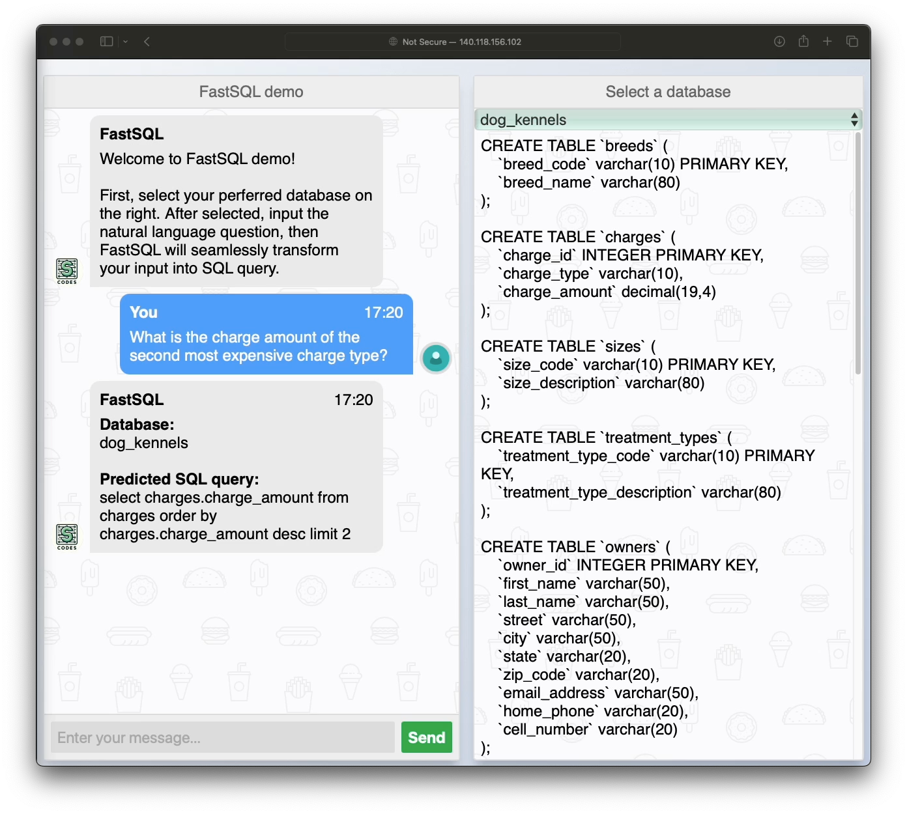

# FastSQL Demo



This repository releases a FastSQL demo.

## Environments 💫

### Step 1: Install Java

Execute the following commands in your terminal:
```bash
apt-get update
apt-get install -y openjdk-11-jdk
```

### Step 2: Create and Activate a Virtual Anaconda Environment
Run these commands to set up your virtual environment:
```bash
conda create -n demo python=3.8.5
conda activate demo
```

### Step 3: Install Required Python Modules
Ensure you have all necessary packages by running:
```bash
conda install pytorch==1.13.1 torchvision==0.14.1 torchaudio==0.13.1 pytorch-cuda=11.7 -c pytorch -c nvidia
pip install -r requirements.txt
```

## Prerequisites 🪐
### Step 1: Download Classifier Weights
Download the the file [sic_ckpts.zip](https://drive.google.com/file/d/19JEC5Ld2Q6K80pUhFOGVCVHMD6t2eupc/view?usp=sharing) for the schema item classifier. Then, unzip the downloaded file in the root directory of the project:
```
unzip sic_ckpts.zip
```

### Step 2: Set Up Databases
By default, this project includes only one database (i.e., `car`) in the `databases` folder. 

- To add and use your own databases:
  1. Place your SQLite database file in the `databases` directory.
  2. Update the `./data/tables.json` file with the necessary information about your database, including:
     - `db_id`: The name of your database (e.g., `my_db` for a database file located at `databases/my_db/my_db.sqlite`).
     - `table_names_original` and `column_names_original`: The original names of tables and columns in your database.
     - `table_names` and `column_names`: The semantic names (or comments) for the tables and columns in your database.

Upon completing these steps, your project should be fully configured.

## Launch services 🚀
To initiate the website, execute the following command:
```
python -u app_fastsql.py
```
This action will start the web application, making it accessible at `http://your_ip:8080/chatbot`. Please note that user's history questions will be logged and can be accessed in the `data/history/history.sqlite` file.

## Acknowledgments ✨
Our code are mainly based on [text2sql-demo](https://github.com/RUCKBReasoning/text2sql-demo), thanks for their magnificant work.

ALso thanks to the teams behind [ChatBot💬 WebApp in Python using Flask](https://github.com/Spidy20/Flask_NLP_ChatBot), [BIRD](https://bird-bench.github.io), and [Spider](https://yale-lily.github.io/spider) for their outstanding contributions to the field.
